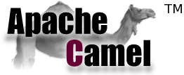

# Integratie met **Camel**

---

# Integratie

* Portals (samenbrengen informatie stromen)
* Data replicatie
* Gedeelde functionaliteit
* SOA (service georiënteerde architectuur)
* Gedistribueerde bedrijfsprocessen
* Business 2 Business integratie

---

# Enterprise Integration Patterns

* Oplossingen voor veel voorkomende integratie vraagstukken
* [EAI Patterns Website](http://www.eaipatterns.com/) 
* [EAI Patterns](http://www.enterpriseintegrationpatterns.com/toc.html)

---

# Apache Camel

Camel is een open source integratie framework

* **Integratie** door middel van routing en mediation engine 
* **Framework** bevat routing engine builder en components
* **Open Source** ondergebracht bij Apache 

.notes: routing & mediation = bepalen: regels voor routering, bronnen van waaruit messages worden geacepteerd, hoe deze te verwerken en door te sturen

.notes: components: ondersteuning voor meer dan 80 protocollen en datatypes voor transport en transformaties

http://camel.apache.org/

.notes: Camel is géen ESB, hoogstens een lightweight ESB (wel monitoring en orchestratie, geen container of message bus)
