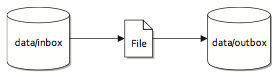

# Waarom **Camel**?

---

# Waarom Camel?

(volgens "Camel in Action")

**Routing and mediation engine**

.notes: routes worden geconfigureerd d.m.v. een combinatie van EIP's en een DSL

**Enterprise Integration Patterns (EIP)**

**Domain-specific languages (DSL)**

.notes: Camel biedt (interne) DSL's in verschillende host programmeertalen, a.k.a. fluent interfaces

* Zie ook: [Fowler over DSL's](http://martinfowler.com/bliki/DomainSpecificLanguage.html)

---

# DSL voorbeelden

Java

	!java
	from("file:data/inbox").to("jms:queue:order");

Spring DSL
	
	!xml
	<route>
		<from uri="file:data/inbox"/>
		<to uri="jms:queue:order"/>
	</route>

Scala
	
	!scala
	from "file:data/inbox" -> "jms:queue:order"

.notes: vermeld IDE support: code completion, compiler error detection e.d.

---

# Waarom Camel?

**Extensive component library**

* Zie ook: [Fuse component reference](http://fusesource.com/docs/router/2.8/component_ref/front.html)

.notes: 80+ componenten voor verschillende transport mechanismes, API's, dataformaten

**Payload-agnostic router**

.notes: niet alleen beperkt tot bijvoorbeeld XML

**Modular and pluggable architecture**

.notes: componenten van Camel, third party of custom, e.g. Bibliotheek adapters

**POJO model**

.notes: beans of POJO's zijn first-class citizens

---

# Waarom Camel?

**Easy configuration**

.notes: convention over configuration, e.g. URI configuratie:

	!java
	from("file:data/inbox?recursive=true&include=*.txt")...

**(Automatic) type converters**

.notes: 150+ converters, kunt ook je eigen converters toevoegen

**Lightweight core**

.notes: beperkt in termn van omvang en dependencies

* Zie ook: [camel-core in Maven repository](http://mvnrepository.com/artifact/org.apache.camel/camel-core/2.9.2)

**Test kit**

.notes: bevat support classes, endpoint mocks, expectations, interceptors e.d.

---

# Waarom Camel?

**Vibrant community**

* [Camel website](http://camel.apache.org)
* [Fusesource website](http://fusesource.com/products/enterprise-camel/#documentation)
* [camel-extra](http://code.google.com/a/apache-extras.org/p/camel-extra/)
* [JIRA](https://issues.apache.org/jira/browse/CAMEL)
* [Contributing](http://camel.apache.org/contributing.html)
* [Mailing lists](http://camel.apache.org/mailing-lists.html)
* [IRC](http://camel.apache.org/irc-room.html)
* [Articles](http://camel.apache.org/articles.html)
* [User stories](http://camel.apache.org/user-stories.html)

---

# Camel voorbeeld

Eerste voorbeeld uit de [Camel in Action source code](http://code.google.com/p/camelinaction/):

chapter1/file-copy

.notes: show 1) pom.xml 2) FileCopier 3) FileCopierCamel

Uitvoeren met:

	!bash
	mvn compile exec:java \
	> -Dexec.mainClass=camelinaction.FileCopierWithCamel
	