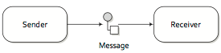
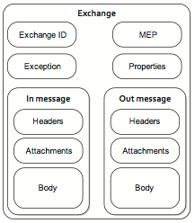
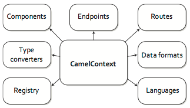
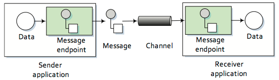
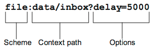

# Routing met **Camel**

---

# Message

Met een **Message** kun je data van het ene naar het andere systeem sturen

Een Camel **Message** heeft een body, headers en optionele attachments

.notes: body = payload

.notes: kunnen ook faults bevatten, t.b.v. SOAP en JBI

---

# Exchange

**Exchange** is het vehikel voor binnenkomende en uitgaande **Messages**, aangevuld met nog wat meta-informatie en een eventuele Exception

.notes: Een exchange ondersteunt verschillende soorten Message Exchange Patterns. MEPs worden gebruikt om verschillende message exchange stijlen te onderscheiden, zoals InOnly en InOut

---

# CamelContext en Registry

De **CamelContext** is de runtime omgeving en bevat verschillende onderdelen, waaronder de **Registry**.

De **Registry** wordt gebruikt om beans op te zoeken

.notes: is afhankelijk van de container

Camel ondersteunt verschillende **Registry** types:

* SimpleRegistry
* JNDI Registry
* Spring ApplicationContext Registry
* OSGi Registry

---

# Route, Processor, DSL en Routing Engine

Een **Route** is een eindige keten van **Processors**, met een begin ("from") en een eind ("to")

.notes: flexibiliteit van routes benadrukken, hebben ook een identifier zodat ze kunnen worden gemanaged

Een **Processor** is een onderdeel waarmee een **Exchange** kan worden gemanipuleerd

**Routes** worden gedefinieerd met de **DSL**

.notes: In Camel komt dit neer op een fluent Java API die methods bevat voor EIP termen

	!java
	from("file:data/inbox")
	    .filter().xpath("/order[not(@test)]")
	    .to("jms:queue:order")
	
.notes: instinkers: 1) scope van de de DSL, 2) volgorde

De **Routing Engine** betreft het mechanisme waarmee messages op de juiste manier verplaatst

	
---

# Endpoint, Channel en Component

Een **Endpoint** betreft het uiteinde van een **Channel**

Een **Endpoint** wordt geconfigureerd door middel van een URI:

Een **Component** is een soort factory voor **Endpoints**

.notes: Er zijn 80+ verschillende componenten die out-of-the-box met Camel worden meegeleverd

---

# Consumers en Producers

Een **Consumer** haalt de messages op van een extern systeem, via verschillende mechanismen, bijvoorbeeld *polling* of *request handling*, of op een *event-gedreven* manier.

Een **Producer** stuurt messages door naar een extern systeem.

---

# Oefening: Camel Routing

Oefening waarbij de verschillende Camel Routing concepten aan bod komen.

Maak gebruik van de [Camel API docs](http://camel.apache.org/maven/current/camel-core/apidocs/index.html)