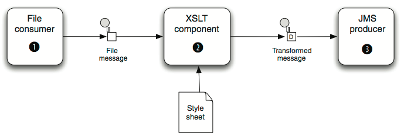
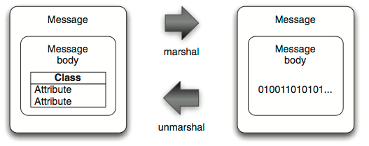

# Mediation met **Camel**

---

# Data transformatie

**Mediation**: het 'bemiddelen' tussen heterogene IT systemen die veelal conform uiteenlopende protocollen werken

Dit komt vaak neer op het transformeren van data die tussen IT systemen wordt uitgewisseld

Twee typen van data transformatie:

Data **format** transformation

* Voorbeeld: transformatie van CSV naar XML

Data **type** transformation

* Voorbeeld: transformatie van <code>java.lang.String</code> naar <code>javax.jms.Textmessage</code>

---

# Data transformatie

Transformatie met **routes**

* E.g. Message Translator of Content Enricher EIPs

Transformatie met **components**

* E.g. XSLT component voor XML transformatie

Transformatie met **data formats**

* E.g. XML met JAXB of Protobuf; JSON met Jackson of XStream

Transformatie met **templates**

* E.g. Apache Velocity of FreeMarker

Transformatie met **type converters**

* E.g. van <code>java.io.File</code> naar <code>java.lang.String</code>s

---

# Transformatie met routes

Message Translator EIP via een Processor:

	!java
	public class OrderToCsvProcessor implements Processor {
    
		public void process( Exchange exchange) throws Exception {
        	String custom = exchange.getIn().getBody(String.class);
			String id = custom.substring(0, 9);
			String customerId = custom.substring(10, 19);
			String date = custom.substring(20, 29);
			String items = custom.substring(30);
			String[] itemIds = items.split("@");
			StringBuilder csv = new StringBuilder();
			csv.append(id.trim());
			csv.append(",").append(date.trim());
			csv.append(",").append(customerId.trim());
			for (String item : itemIds) {
				csv.append(",").append(item.trim());
			}
			exchange.getIn().setBody(csv.toString());
		}
	}
	
---

# Transformatie met routes

Gebruik van <code>OrderToCsvProcessor</code> in een Camel route:

	!java
	from("quartz://report?cron=0+0+6+*+*+?")
		.to("http://riders.com/orders/cmd=received&date=yesterday") 
		.process(new OrderToCsvProcessor())
		.to("file://riders/orders?fileName=report-${header.Date}.csv");
		
---
		
# Transformatie met components

XSLT transformatie:

Gebruik van de XSLT component in een Camel route:

	!java
	from("file://rider/inbox")
	    .to("xslt://camelinaction/transform.xsl")
	    .to("activemq:queue:transformed")
	
---

# Transformatie met data formats

Marshallen en unmarshallen van data:

Gebruik van de camel-csv data format in een Camel route:

	!java
	from("file://rider/csvfiles")
		.unmarshal().csv()
	    .split(body()).to("activemq:queue.csv.record");

---

# Transformatie met templates

Velocity template voorbeeld:

	!velocity
	Dear customer
	Thank you for ordering ${body.amount} piece(s) of ${body.name} 
	at a cost of ${body.price}.
	This is an automated email, please do not reply.

Camel Route:

	!java
	from("direct:sendMail")
		.setHeader("Subject", constant("Thanks for ordering")) 
		.setHeader("From", constant("donotreply@riders.com")) 
		.to("velocity://rider/mail.vm") 
		.to("smtp://mail.riders.com?user=camel&password=secret");

---

# Transformatie met type converters

Camel biedt een ingebouwd type-converter systeem waarmee op automatische wijze tussen gangbare data types wordt geconverteerd.

Bijvoorbeeld, als in de <code>OrderToCsvProcessor</code>:

	!java
	String custom = exchange.getIn().getBody(String.class);

Camel gebruikt daarbij de <code>TypeConverterRegistry</code> om een geschikte <code>TypeConverter</code> te vinden.

Camel Route:

Oefening!
