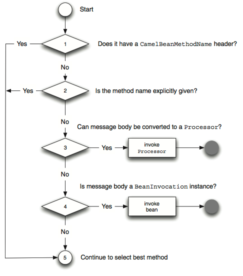
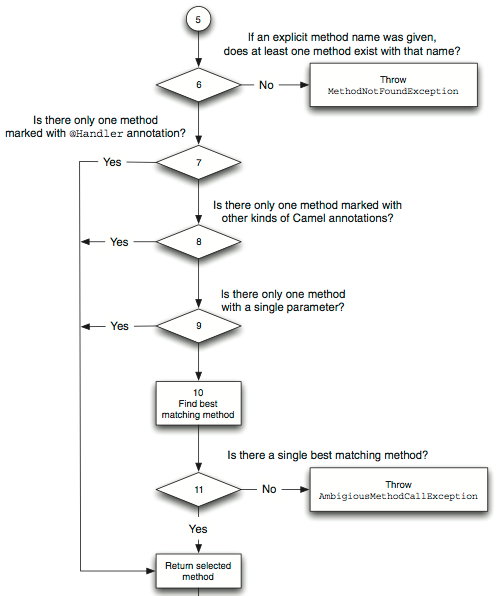
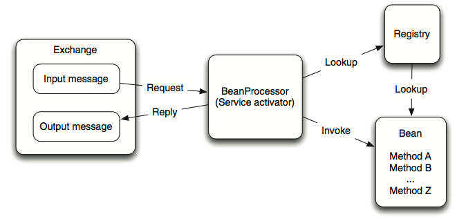
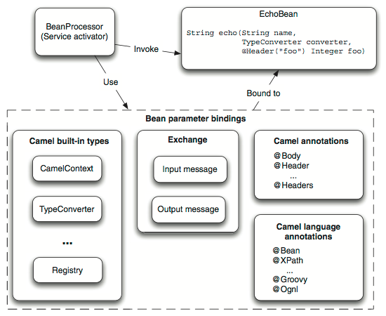

# **Camel** Beans

--- 

# Uitdaging

Inherente problemen met component models (zoals CORBA, EJB, JBI, SCA, OSGi):

* Leaky abstractions
* Programmeren met restricties
* Beperkte testbaarheid
* ...

---

# Camel met Beans

Bean voorbeeld:

	!java
	public class HelloBean {
	    public String hello(String name) {
	        return "Hello " + name;
		} 
	}

Bean declaratie in Spring applicationContext:

	!xml
	<bean id="helloBean" class="camelinaction.HelloBean"/>
	
Toepassen bean referentie in Camel route:

	!java
	public void configure() throws Exception {
		from("direct:hello").beanRef("helloBean", "hello");
	}

---

# Selecteren van beans

De **Service Activator** medieert tussen de requester en de POJO service:

De service activator is de <code>BeanProcessor</code> in Camel

De POJO service is onze <code>HelloBean</code> bean

---

# Selecteren van bean methods

---

# Selecteren van bean methods

---

# Selecteren van bean en methods

Oefening!

---

# Opzoeken van beans

De bean wordt aan de hand van de <code>beanRef</code> opgezocht in Camel's bean registry

---

# Opzoeken van beans

Oefening!

---

# Parameter binding

---

# Parameter binding

Oefening!
