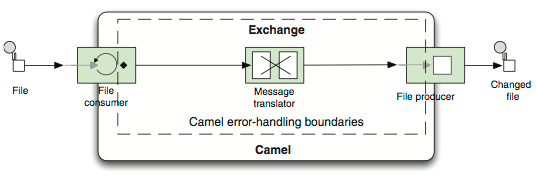
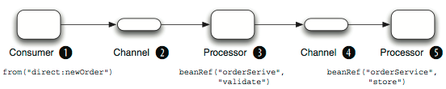

# Error Handling met **Camel**

--- 

# Error Handling

Error handling is van toepassing gedurende de lifecycle van deze exchange

Errors komen in twee soorten:

* Recoverable
* Irrecoverable

---

# Throwable/Exception

Errors van het type 'recoverable' worden binnen de Exchange gerepresenteerd als een <code>Throwable</code> of <code>Exception</code> en worden ongeveer als volgt gezet:

	!java
	try {
		processor.process(exchange);
	}
	catch(Throwable t) {
		exchange.setException(e);
	}
	
.notes: <code>getException</code> geeft geen <code>Throwable</code> terug vanwege API compatibility.

---

# Fault

Errors van het type 'irrecoverable' worden gerepresenteerd als een message met een 'fault flag', bijvoorbeeld:

	!java
	Message msg = Exchange.getOut();
	msg.setFault(true);
	msg.setBody("Unknown customer");
	
.notes: het concept van fault message is een resultaat van de JBI specificatie die vanaf het begin door Camel is gevolgd

---

# Error handlers

Camel error handlers gaan pas 'handlen' wanneer er excepties zijn toegevoegd aan de Exchange.

Typen error handlers:

* DefaultErrorHandler
* DeadLetterChannel
* TransactionErrorHandler
* NoErrorHandler
* LoggingErrorHandler

---

# DefaultErrorHandler

Voorbeeld:

	!java
	from("direct:newOrder")
		.beanRef("orderService, "validate")
		.beanRef("orderService, "store");
		

De <code>DefaultErrorHandler</code> werkt daarbij als volgt:

Wanneer er een fout optreedt bij 3) dan wordt er een exception gegoooid die terug wordt gepropageerd naar 2) en vervolgens zal de ErrorHandler deze catchen

Op dat moment zou Camel het met de message opnieuw kunnen proberen (redelivery), maar bij de <code>DefaultErrorHandler</code> gebeurt dat niet.

---

# Error Handler features

De verschillende ErrorHandlers onderscheiden zich van elkaar aan de hand van de volgende features:

* Redelivery policy
* Scope
* Exception policies
* Error handling

---

# Redelivery policy

* Bepaalt of redelivery plaatsvindt
* Zo ja, het maximaal aantal pogingen
* De tijdsinterval tussen pogingen
* Etc.

Voorbeeld:

	!java
	errorHandler(defaultErrorHandler()
	    .maximumRedeliveries(2)
	    .redeliveryDelay(1000)
	    .retryAttemptedLogLevel(LoggingLevel.WARN));
	
	from("seda:queue.inbox")
		.beanRef("orderService","validate")
		.beanRef("orderService","enrich")
		.log("Received order ${body}")
		.to("mock:queue.order");

---

# Scope

Twee scope levels: context en route

Voorbeeld:

	!java
	errorHandler(defaultErrorHandler()
	    .maximumRedeliveries(2)
	    .redeliveryDelay(1000)
	    .retryAttemptedLogLevel(LoggingLevel.WARN));
	from("file://target/orders?delay=10000")
	    .beanRef("orderService", "toCsv")
	    .to("mock:file")
	    .to("seda:queue.inbox");
		from("seda:queue.inbox")
	.errorHandler(deadLetterChannel("log:DLC")
		.maximumRedeliveries(5)
		.retryAttemptedLogLevel(LoggingLevel.INFO)
		.redeliveryDelay(250)
		.backOffMultiplier(2)) 
		.beanRef("orderService", "validate")
		.beanRef("orderService", "enrich")
		.to("mock:queue.order");		

---

# Error handling: exception policies

Intercepten en afhandelen van specifieke exceptions door middel van de <code>onException</code> method in de route.

Uitgaande van de volgend Exception hierarchie:

	!text
	org.apache.camel.RuntimeCamelException
	com.mycompany.OrderFailedException
	java.net.ConnectException

waarbij de ConnectException wordt gewrapt in de OrderFailedException (en vervolgens door Camel gewrapt in de RuntimeCamelException)

Hoe wordt het volgende afgehandeld?

	!java
	onException(OrderFailedException.class).maximumRedeliveries(3);

.notes: dit zal resulteren in allereerst het evalueren van de ConnectException en kijken of deze gelijk is aan of een subclass is van OrderFailedException, vervolgens wordt een niveau hoger gekeken in de exception hierarchie en zal vervolgens een match vinden

---

# Error Handling

Oefening!
